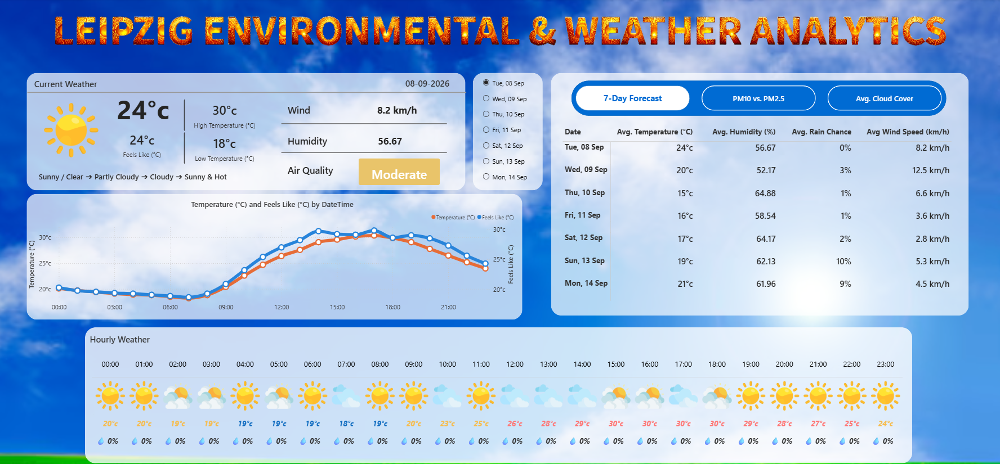

# Leipzig Weather & Air Quality Analytics 🌦️

An interactive Power BI dashboard providing **live 7-day weather and air quality analytics for Leipzig, Germany** — built using Python-powered data ingestion from the free, keyless **Open-Meteo API**.



---

## 📊 What This Dashboard Does

- **Current weather snapshot** — temperature, feels-like, humidity, wind, air quality
- **7-day interactive forecast** with day selector and drill-through
- **Hourly weather strip** — 24-hour breakdown with icons, temperature, and rain chance
- **Dual-axis chart** comparing Temperature vs. Feels-Like over time
- **PM10 vs PM2.5 analysis** for air quality tracking
- **Average cloud cover** trend view

## 🛠️ Tech Stack

| Layer | Technology |
|---|---|
| **Visualization** | Power BI Desktop (DAX, custom themes, multi-page report) |
| **Data Ingestion** | Python (requests, pandas) executed via Power Query |
| **Data Source** | [Open-Meteo API](https://open-meteo.com) — free, keyless, open-source |
| **Air Quality** | Open-Meteo Air Quality endpoint (PM2.5, PM10, US EPA, European AQI) |
| **Refresh** | Manual & scheduled refresh via Power BI |

## 🔧 Architecture

```
Open-Meteo Forecast API  ─┐
                          ├──► Python (in Power Query) ──► Pandas DataFrame ──► Power BI Model ──► DAX Measures ──► Visuals
Open-Meteo Air Quality API ─┘
```

## 🚀 How to Run Locally

1. Clone this repo
2. Open `Weather_Report_Dashboard.pbix` in [Power BI Desktop](https://powerbi.microsoft.com/desktop) (free)
3. Ensure Python is installed with `pandas` and `requests` (Power BI uses your local Python)
4. Click **Refresh** — data updates from Open-Meteo live
5. No API key required 🎉

## 📁 Repository Structure

- `Weather_Report_Dashboard.pbix` — the Power BI report
- `src/weather_data_fetch.py` — standalone Python script (same logic as embedded)
- `screenshots/` — dashboard previews
- `README.md` — this file

## 🎯 Design Decisions

- **Why Open-Meteo?** After initial development with WeatherAPI.com, I migrated to Open-Meteo because it offered a longer forecast window on the free tier, required no API key (safer for open-source portfolios), and is CC BY 4.0 licensed.
- **Why Python inside Power Query?** Enabled defensive JSON parsing with `.get()` fallbacks — cleaner than deeply nested M-language transformations.
- **Why Leipzig?** I'm based in Leipzig, Germany 🇩🇪, currently pursuing my M.Sc. in Big Data & AI at SRH Hochschule Leipzig.

## 📸 Screenshots

### Main Dashboard


## 📄 License & Attribution

Weather data © [Open-Meteo](https://open-meteo.com) — CC BY 4.0  
Dashboard code © 2026 Danush Kumar Sekar — MIT License

## 👤 Author

**Danush Kumar Sekar** — M.Sc. Big Data & AI, SRH Hochschule Leipzig  
📍 Leipzig, Germany | 💼 [LinkedIn](https://www.linkedin.com/in/danushkumarsekar) | 📧 danushsekars@gmail.com
